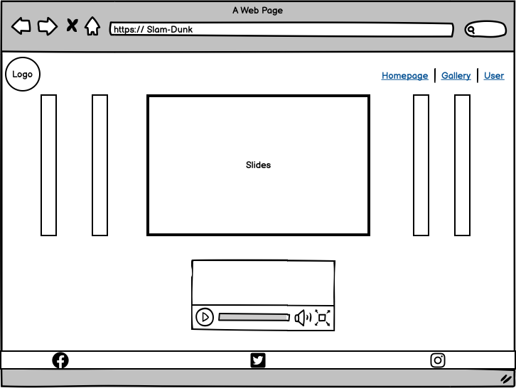
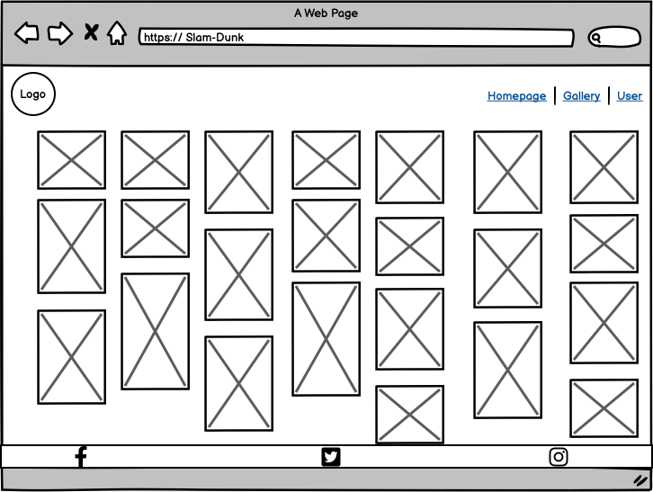

# Slam-Dunk Music Box

The purpose for doing this site was motivated by Slam-Dunk film coming back next year after 20 years. The Slam Dunk cartoon has a profound impression on our generation. In memory of younger time, there are serveral classic Slam-Dunk songs collected to build this site. The live site can be found [here](https://mabin9527.github.io/SLAM-DUNK-PP2/).

# Table of contents
- [Wireframes](#wireframes)
- [Design](#design)
- [Technologies Used](#technologies-used)
- [Features](#features)
    - [Existing Features](#existing-features)
        - [Navigation](#navigation)
        - [Slides](#slides)
        - [Music-player](#music-player)
        - [Footer](#homepage)
        - [Gallery](#gallery)
        - [User](#user)
- [Testing](#testing)
- [Credits](#credits)

# Wireframes

# Design

**Text & Background color**

In order to give users better vision experience, dark grey is selected to be background color for navigation-bar and footer and light grey for text color and music player backgrond player, which gives a feeling of clean and luxurious. Also users are able to find useful information on the site.

### Fonts
For consistency the webpage was designed by importing Nato Sans font style that look likes simple, clean and friendly to website user.

# Technologies Used

### Languages
- HTML
- CSS
- Javascript

### Tools
- Git
- GitHub
- Gitpod
- Google Fonts
- Adobe Color
- Font Awsome
- Favicon.io

# Features

## Existing Features:

### Navigation

- To provide the user with simple and clean navigation across all three pages, header includes music logo, homepage, gallery and user icon. 
- The related text will be displayed under the icon when mouse is over the icon. At the same time, icon is smaller and move to top-direction. 
- To realize function previous mentioned, Javascript has been applied which add a class style when mouse hover.

