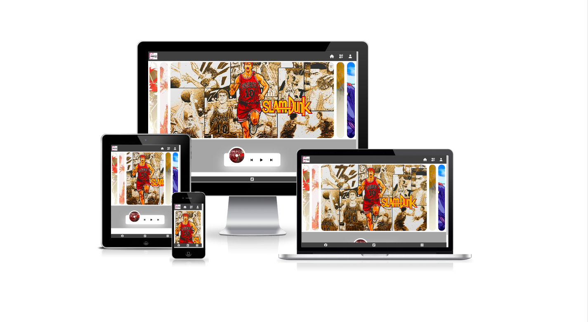
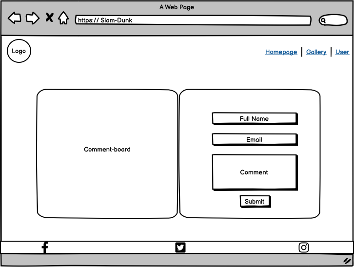
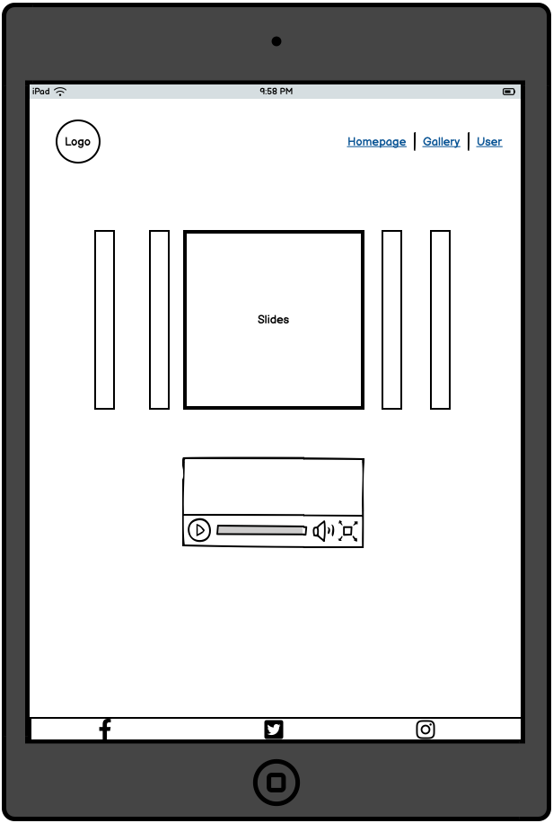
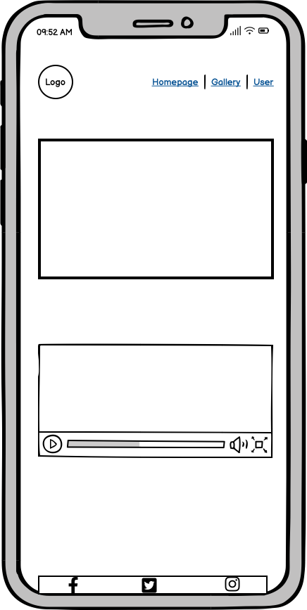

# Slam-Dunk Music Box

The purpose for doing this site was motivated by Slam-Dunk film coming back next year after 20 years. The Slam Dunk cartoon has a profound impression on our generation. In memory of younger time, there are serveral classic Slam-Dunk songs collected to build this site. The live site can be found [here](https://mabin9527.github.io/SLAM-DUNK-PP2/).

# Table of contents
- [Wireframes](#wireframes)
- [Design](#design)
- [Technologies Used](#technologies-used)
- [Features](#features)
    - [Existing Features](#existing-features)
        - [Navigation](#navigation)
        - [Slides](#slides)
        - [Music-player](#music-player)
        - [Footer](#homepage)
        - [Gallery](#gallery)
        - [User](#user)
- [Testing](#testing)
- [Credits](#credits)

# Wireframes

# Design

**Text & Background color**

In order to give users better vision experience, dark grey is selected to be background color for navigation-bar and footer and light grey for text color and music player backgrond player, which gives a feeling of clean and luxurious. Also users are able to find useful information on the site.

### Fonts
For consistency the webpage was designed by importing Nato Sans font style that look likes simple, clean and friendly to website user.

# Technologies Used

### Languages
- HTML
- CSS
- Javascript

### Tools
- Git
- GitHub
- Gitpod
- Google Fonts
- Adobe Color
- Font Awsome
- Favicon.io

# Features

## Existing Features:

### Navigation

- To provide the user with simple and clean navigation across all three pages, header includes music logo, homepage, gallery and user icon. 
- The related text will be displayed under the icon when mouse is over the icon. At the same time, icon is smaller and move to top-direction. 
- To realize function previous mentioned, Javascript has been applied which add a class style when mouse hover.

### Slides

- Compared with normal carousel the design of this site is more attractive and fun.
- User can see full images by clicking slides, which can be realized combining with Javascript and CSS.

### Music-player

- Music player containes three main parts that provide users with songs' information and give them a better vision experience.
- Left part is albums-cover that can be rotated and is going up when music player is on. Besides, albums-cover is automatically changed as songs are different.
- Main part is control button that allows user play last and next songs. Also it can be stoped through play / pause button.
- The third part is songs' information including name, singer and play time. It is displayed only when player is on.

### Footer

- Featured on all three pages

### Gallery

- The photo gallery is fully explained the passion and history of Slam Dunk cartoon.
- It is fully responsive manipulated by Javascript.

### User

- Show customers the way to give us feedback to the musci player.
- The comments can be displayed directly on the left side that allows other users to see their opions. Additionally, those comments can be deleted by click trash icon right side.

---

## Future Features

In the future, the track-time will be realized in music box by using Javascript. I have little bit thought on play-time. But there are always some bugs unsoloved. I will continue to work those features which allows user to fast-forward or -backward to some specific point.

## Validation

### Javascript Validation

The JS Hint was used to validate the Javascript of the website. There are no errors found across all three pages. 

Homepage

Gallery

User

### HTML Validation
The W3C Markup Validation Service was used to validate the HTML of the website. There are no errors found across all three pages. 

Homepage

Gallery

User

### CSS Validation
The W3C Jigsaw CSS Validation Service was used to validate CSS of the website.
There is no error found on CSS file.

style.css

### Performance 
Google Lighthouse in Google Chrome Developer Tools was used to test the performance of the website. The page achieved good performance on desktop and mobile.

Desktop

Mobile

## Bugs

- There was a common issue happend for beginners that tried to get a series of images container using DOM in gallery photos. But quertSelector has been used rather than querySelectorAll, which caused its' offsetWidth can't be obtained. Checked line by line to found it and fix it.

## Unsolved Bugs

- In music player part, music track time and total time are supposed to have. Tried to get the default music player attribute of track time and total time. And then connected it with designed music box to realize track time function. However, I was failed to get the attribute.

- For progress bar, it should have fast-forward and fast-backward function. I don't have a clue to do it now. But I will definately continue to do it.

## Deployment

The site was deployed to GitHub pages. The steps to deploy are as follows:

In the GitHub repository, navigate to the Settings tab. On the left-hand side under ‘Code and automation’, select ‘Pages’ and from the source section drop-down menu, select the Master Branch. Once the master branch has been selected, the page will be automatically refresh with a detailed ribbon display to indicate the successful deployment.
The live link can be found here - 
https://mabin9527.github.io/SLAM-DUNK-PP2/

## Credits

### Media

- [img1](assets/images/gallery/img1.jpeg): Photo can be found <a href="https://www.cna.com.tw/news/amov/202209230189.aspx">here</a>
- [img2](assets/images/gallery/img2.jpeg): Photo can be found <a href="https://www.jiemian.com/article/2454954.html">here</a>
- [img3](assets/images/gallery/img3.jpeg): Photo can be found <a href="https://www.gq.com.tw/entertainment/article/the-first-slam-dunk-%E5%8F%B0%E7%81%A3">here</a>
- [img4](assets/images/gallery/img4.jpeg): Photo can be found <a href="https://www.gq.com.tw/gadget/article/%E7%81%8C%E7%B1%83%E9%AB%98%E6%89%8B-%E6%89%8B%E9%81%8A-ios-android-%E4%B8%8B%E8%BC%89">here</a>
- [img5](assets/images/gallery/img5.jpeg): Photo can be found <a href="https://www.orientaldaily.com.my/news/entertainment/2022/11/22/528337">here</a>
- [img6](assets/images/gallery/img6.jpeg): Photo can be found <a href="https://mb.com.ph/2021/01/07/slam-dunk-author-teases-fans-with-upcoming-film/">here</a>
- [img7](assets/images/gallery/img7.jpeg): Photo can be found <a href="https://www.theanimedaily.com/the-first-slam-dunk-release-date/">here</a>
- [img8](assets/images/gallery/img8.jpeg): Photo can be found <a href="https://www.rappler.com/entertainment/movies/the-first-slam-dunk-teaser-trailer/">here</a>
- [img9](assets/images/gallery/img9.jpeg): Photo can be found <a href="https://www.si.com/extra-mustard/2013/05/07/slam-dunk-how-japans-love-of-basketball-can-be-traced-back-to-a-comic">here</a>
- [img10](assets/images/gallery/img10.jpeg): Photo can be found <a href="https://www.thetealmango.com/entertainment/the-new-the-first-slam-dunk-trailer-is-here/">here</a>
- [img11](assets/images/gallery/img11.jpeg): Photo can be found <a href="https://www.filmaffinity.com/us/movieimage.php?imageId=382685294">here</a>

